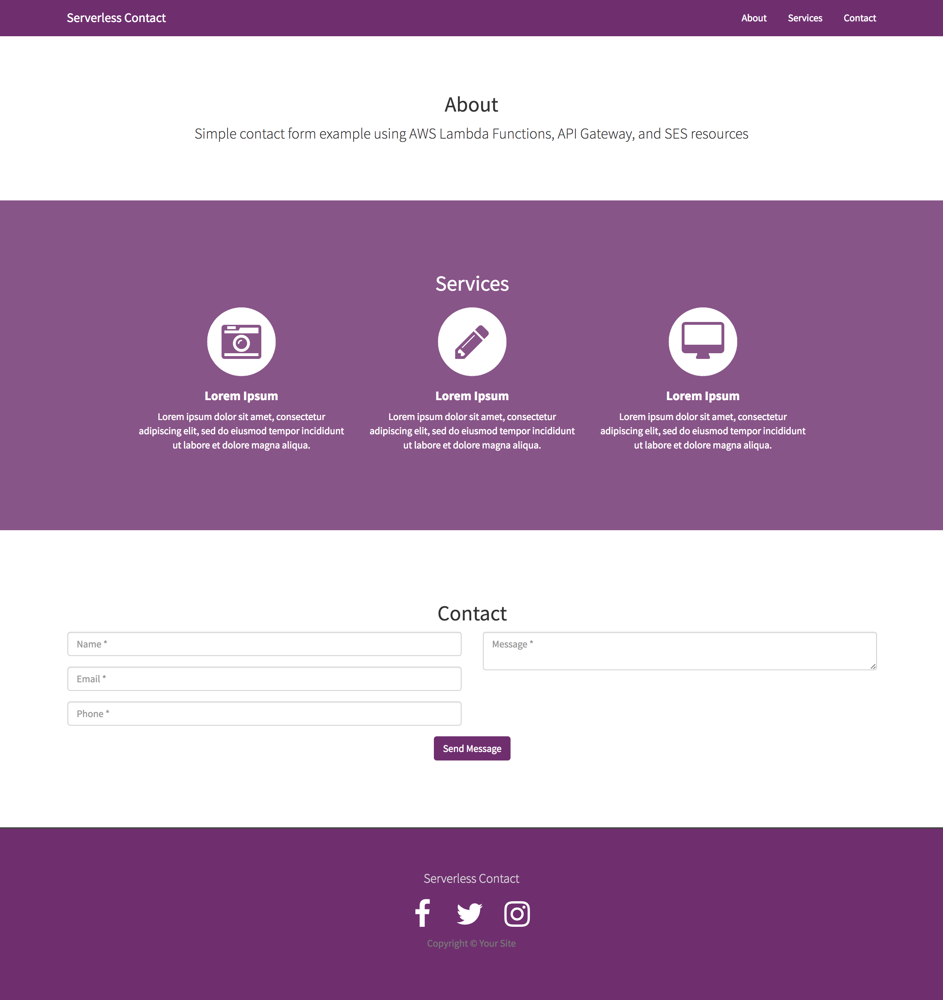
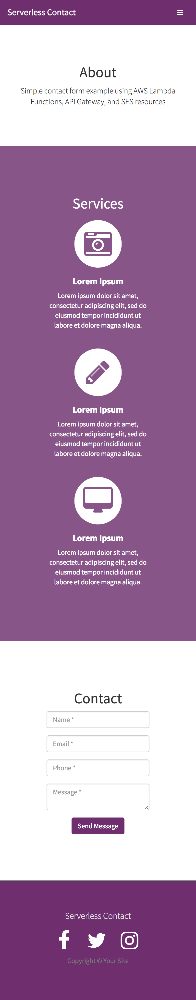

# Serverless Contact

## Description
Serverless Contact is an AWS Lambda function that utilizes AWS SES to send emails from a registered web page by a potential client to the site owner. This setup is especially handy for those running static sites on storage bucket or GitHub Pages.

## Usage
In order to use the serverless contact form, the user must have all mail records with aws assigned in SES and the email address verified. After that, simply modify the contactForm.js with the user's individual email address in the '_toAddress' and '_source' variables at the top of the file.

The user must also create their own lambda function using the index.js code in /src. Please see steps below.

### 1.) Creating an AWS Lambda Function
Sign into your AWS Console and select AWS Lambda from the collection of services. Be sure to select a blank AWS Lambda Function template and paste the contents of /src/index.js into there. Name your function, connect the role to an existing role, a form processor role with SES permissions, and save.

### 2.) Verifying Clients (Email Addresses)
To add a new client to your list of permitted users, you will need to verify the email address in AWS SES.

### 3.) Test with Example Project
For easy setup/test, please feel free to use the example project's contact form and respective contactForm.js file to test out your new serverless contact form solution.

The best step by step for this can be found on code engine by David Maple, <a href="https://www.codeengine.com/articles/process-form-aws-api-gateway-lambda/">Process-form-aws-api-gateway-lambda</a>.

#### Desktop Screenshot

#### Mobile Screenshot

#### Happy Hacking!
